<div align="center">

# ⚛️ The Atomic Node Engine
### The Ultimate Server-Side Rendered Task System

[](https://the-atomic-node-engine.onrender.com)


</div>

---

<details>
  <summary><b>📚 Table of Contents (Click to Expand)</b></summary>
  <br />
  
- [⚛️ The Atomic Node Engine](#️-the-atomic-node-engine)
    - [The Ultimate Server-Side Rendered Task System](#the-ultimate-server-side-rendered-task-system)
  - [🏗️ Project Architecture](#️-project-architecture)
  - [📊 Live Developer Stats](#-live-developer-stats)
  - [📂 File Ecosystem](#-file-ecosystem)
  - [🛠️ Installation Protocol](#️-installation-protocol)
  - [🗺️ Roadmap](#️-roadmap)
  - [🌐 Network](#-network)
</details>

---

## 🏗️ Project Architecture

This is not a simple script. It is a structured **MVC Application**. Below is the live data flow of the engine, rendered dynamically:

```mermaid
graph LR
    User((User)) -->|HTTP Request| Render[Render Cloud]
    Render -->|Forward| Server[Bun/Node Server]
    
    subgraph "Backend Engine"
        Server --> Router{Express Router}
        Router -->|GET /| Controller
        Router -->|POST /create| DB[(In-Memory Storage)]
    end
    
    subgraph "Frontend View (SSR)"
        Controller -->|Data| EJS[EJS Templates]
        EJS -->|HTML| Compiler
    end
    
    Compiler -->|Response| User
    
    style User fill:#f9f,stroke:#333,stroke-width:2px
    style Render fill:#000,stroke:#fff,stroke-width:2px
    style EJS fill:#B4CA65,stroke:#333,stroke-width:2px

```



**Technology Stack:**
`Node.js` | `Bun` | `Express.js` | `EJS` | `CSS3` | `Render`

---

## 📊 Live Developer Stats

Real-time metrics pulled from my coding activity. This proves the work put into the code.

<div align="center">

<a href="https://wakatime.com/@__https_shivu">

</a>


</div>

---

## 📂 File Ecosystem

Mapped directly from the source functionality:

| File / Folder | Description |
| --- | --- |
| `views/index.ejs` | The main dashboard interface. |
| `views/Edit-Task.ejs` | Dynamic form handling for task updates. |
| `render.yaml` | Infrastructure-as-Code (IaC) for cloud deployment. |
| `bun.lock` | High-performance binary lockfile. |
| `index.js` | Core server logic and routing engine. |

---

## 🛠️ Installation Protocol

Click the sections below to expand the setup instructions.

<details>
<summary><b>⚡ Option A: Using Bun (Recommended/Fastest)</b></summary>

```bash
# 1. Clone the repository
git clone [https://github.com/Dev-Shivam-05/PR-02-CREATING-TODO-LIST.git](https://github.com/Dev-Shivam-05/PR-02-CREATING-TODO-LIST.git)

# 2. Install dependencies (Hyper-fast)
cd PR-02-CREATING-TODO-LIST
bun install

# 3. Ignite the Engine
bun index.js

```

</details>

<details>
<summary><b>🐢 Option B: Using Standard Node (NPM)</b></summary>

```bash
# 1. Clone the repository
git clone [https://github.com/Dev-Shivam-05/PR-02-CREATING-TODO-LIST.git](https://github.com/Dev-Shivam-05/PR-02-CREATING-TODO-LIST.git)

# 2. Install dependencies
npm install

# 3. Start Server
npm start

```

</details>

---

## 🗺️ Roadmap

Current development trajectory and upcoming features:

* [x] **Phase 1:** Core MVC Structure Setup (Completed)
* [x] **Phase 2:** Cloud Deployment on Render (Completed)
* [ ] **Phase 3:** Database Integration (MongoDB/Postgres)
* [ ] **Phase 4:** User Authentication (Passport.js)
* [ ] **Phase 5:** Dark Mode Toggle

---

## 🌐 Network

Connect with me. I am open to high-level engineering discussions.

| Platform | Profile Link (Click Badge) |
| --- | --- |
| **GitHub** | [GitHub](https://github.com/Dev-Shivam-05) |
| **WakaTime** | [WakaTime](https://wakatime.com/@__https_shivu) |
| **LinkedIn** | [LinkedIn](https://www.linkedin.com/in/shivam-bhadoriya-dev/) |
| **X (Twitter)** | [X](https://x.com/Dev_Shivam_05) |
| **Instagram** | [Instagram](https://www.instagram.com/__https.shivu) |

<br />

<div align="center">

</div>

```