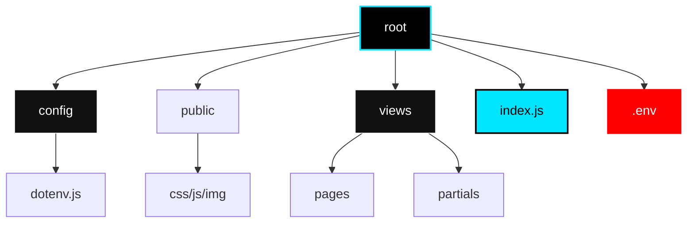
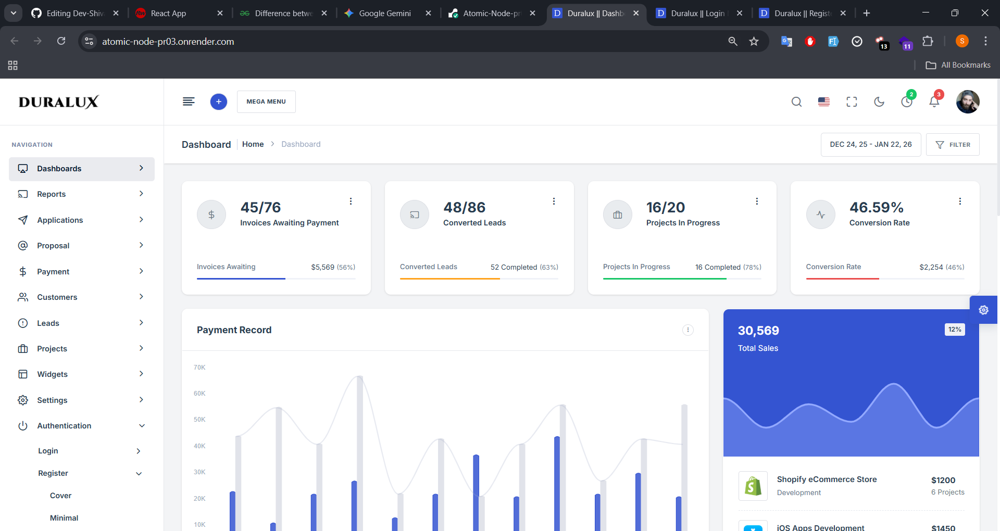
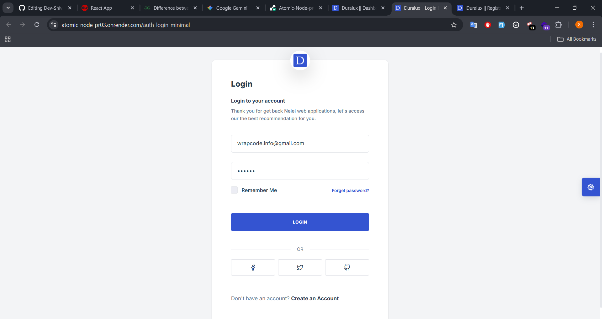
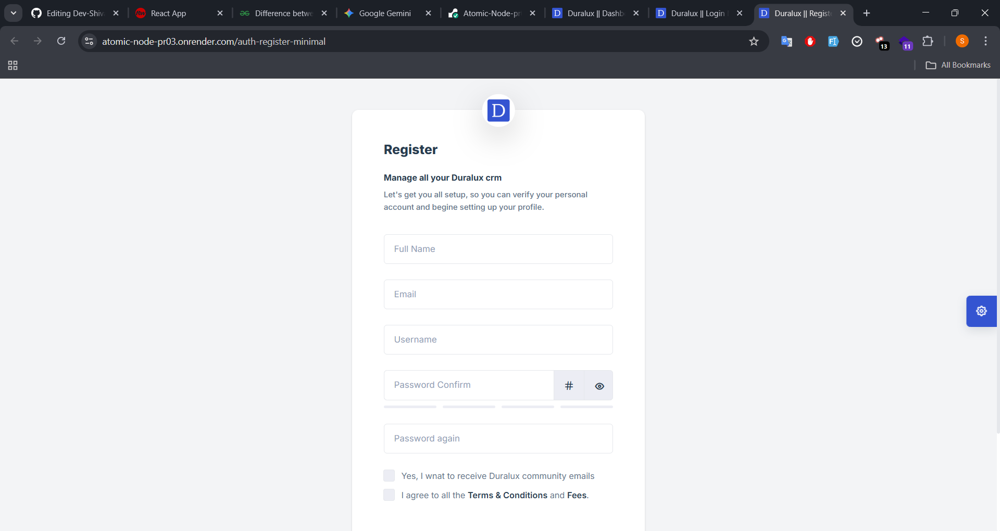

<!-- ----------------------------------------------------------------------- -->
<!--                             HEADER SECTION                              -->
<!-- ----------------------------------------------------------------------- -->

<div align="center">
  

  <!-- LIVE SYSTEM BANNER - UNMISSABLE -->
  <br />
  <div align="center" style="margin-top: -80px;">
  <a href="https://atomic-node-pr03.onrender.com/">
    
  </a>
</div>

<br />

  <a href="https://atomic-node-pr03.onrender.com/">
    
  </a>
  <br />
  
  <!-- SHIELDS GRID -->
  
  
  

</div>

<br />

<!-- ----------------------------------------------------------------------- -->
<!--                       INTRODUCTION & FEATURES GRID                      -->
<!-- ----------------------------------------------------------------------- -->

## ⚡ **The Atomic Paradigm**

<table width="100%">
<tr>
<td width="50%" valign="top">

### 💀 The Death of Static Code
Standard Node.js boilerplate is messy. It mixes logic with views, exposes API keys, and creates "Spaghetti Code" that is impossible to scale.

The **Atomic Node Engine (PR-03)** is a **Server-Side Rendering (SSR)** fortress. We utilize the **Atomic Design Principle** to decouple the backend architecture.

> *"We do not write code to work. We write code to scale."*

</td>
<td width="50%" valign="top">

### 💎 Core Capabilities
*   **SSR Injection:** Zero-latency EJS rendering.
*   **Vault Security:** Centralized `config/dotenv.js` protocol.
*   **Atomic Routing:** Modular controller logic.
*   **Duralux UI:** Enterprise-grade dashboard pre-installed.
*   **MVC Pattern:** Strict separation of Data, Logic, and View.

</td>
</tr>
</table>

---

<!-- ----------------------------------------------------------------------- -->
<!--                        ARCHITECTURE (MERMAID)                           -->
<!-- ----------------------------------------------------------------------- -->

## 🏗️ **Architectural Blueprint**

We don't dump files in the root. We architect systems. This project uses the **Atomic Design Principle** applied to backend folder structures.

<div align="center">



</div>

---

<!-- ----------------------------------------------------------------------- -->
<!--                         VISUAL RECONNAISSANCE                           -->
<!-- ----------------------------------------------------------------------- -->

## 👁️ **Visual Reconnaissance**

<div align="center">
  <h3>▼ MISSION CONTROL (DASHBOARD) ▼</h3>
  
</div>

<br/>

<table width="100%">
<tr>
<td width="50%" align="center">
  <b>🔐 Secure Gateway (Login)</b><br>
  
</td>
<td width="50%" align="center">
  <b>📝 Injection Protocol (Register)</b><br>
  
</td>
</tr>
</table>

---

<!-- ----------------------------------------------------------------------- -->
<!--                          DEPLOYMENT PROTOCOL                            -->
<!-- ----------------------------------------------------------------------- -->

## ⚙️ **Deployment Protocol**

This is a precise system. Do not deviate from the instructions.

### **Phase 1: Asset Extraction**
```bash
git clone https://github.com/Dev-Shivam-05/PR-03-Atomic-Node-Engine.git
cd PR-03-Atomic-Node-Engine
```

### **Phase 2: Dependency Hydration**
```bash
npm install
```

### **Phase 3: Configuration (CRITICAL)**
<table width="100%">
<tr>
<td>
⚠️ <b>WARNING:</b> The engine will not ignite without the <code>.env</code> file. Create it in the root directory.
</td>
</tr>
</table>

```env
PORT=8081
NODE_ENV=development
# Add your encryption keys here
```

### **Phase 4: Ignition**
```bash
npm run dev
```

> **Console Output:** `[ATOMIC NODE] 🟢 System Online :: Port 8081`

---

<!-- ----------------------------------------------------------------------- -->
<!--                                FOOTER                                   -->
<!-- ----------------------------------------------------------------------- -->

<div align="center">
  
  
  <br/><br/>

  <a href="https://github.com/Dev-Shivam-05">
    
  </a>
  <a href="https://www.linkedin.com/in/shivam-bhadoriya-b82792324/">
    
  </a>
  <a href="https://www.instagram.com/__https.shivu/">
    
  </a>
</div>
```