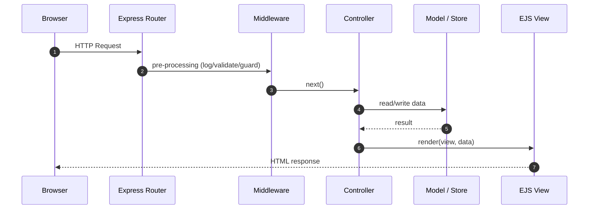
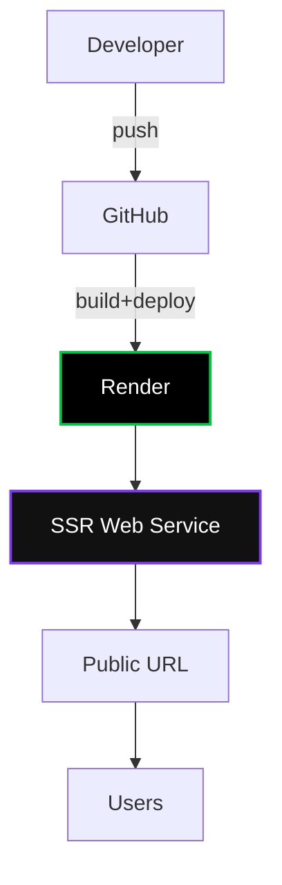
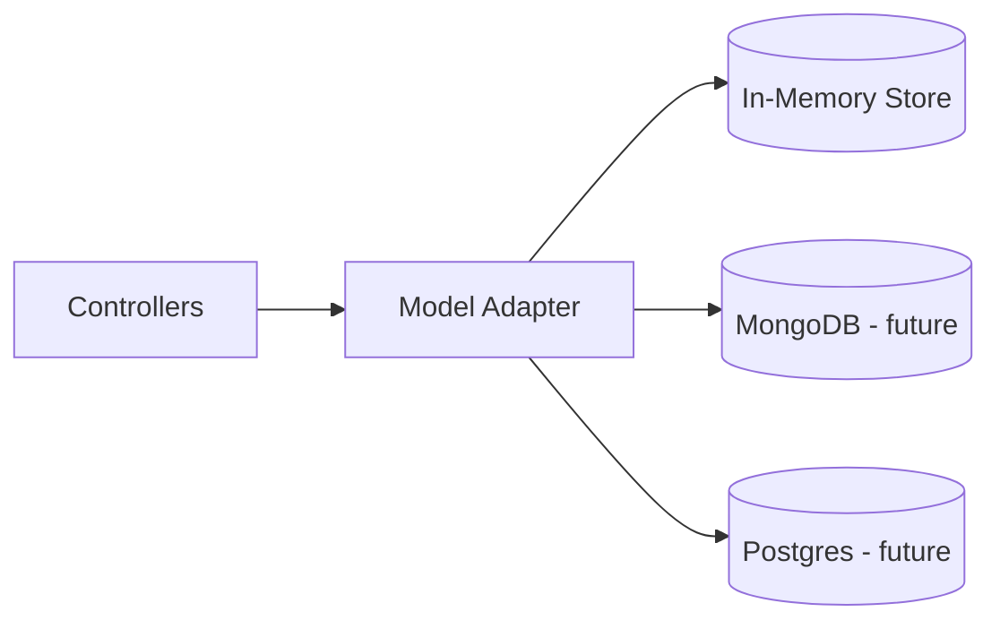

<div align="center">

**LIVE DEPLOYMENT:**  
https://pr-04-book-store-in-the-atomic-node.onrender.com

<br/>


<br/><br/>

<a href="#-command-center"><b>Command Center</b></a> •
<a href="#-features"><b>Features</b></a> •
<a href="#-architecture-atlas"><b>Architecture</b></a> •
<a href="#-run-locally"><b>Run Locally</b></a> •
<a href="#-deploy-to-render"><b>Deploy</b></a> •
<a href="#-quality-gates"><b>Quality Gates</b></a> •
<a href="#-roadmap"><b>Roadmap</b></a>

</div>

---

## 🧠 What this is (in one breath)

Atomic Node Book Store is a **server-side rendered bookstore** built with **disciplined MVC boundaries**.  
It’s structured to evolve from **in-memory prototype** → **database-backed catalog** → **auth + admin platform** with minimal architectural debt.

> If a repo can’t explain itself in 90 seconds, it’s not an application — it’s a folder.

---

## 🧭 Command Center

<div align="center">

| Panel | Purpose | Outcome |
|------|---------|---------|
| **🔥 Product Surface** | SSR pages rendered server-side | Fast first paint + simple hosting |
| **🧬 MVC Core** | Clean separation of concerns | Easy refactors, easy features |
| **🧱 Middleware Layer** | Logging / validation / guards | Predictable requests, safer code |
| **☁ Deploy Doctrine** | Render deployment posture | Repeatable deploys, fewer “works locally” lies |
| **🧪 Quality Gates** | Health checks + error posture | Reliability, debuggability |

</div>

---

## 🔥 Features

### Product-facing
- **SSR UI with EJS** (server-rendered pages, predictable, SEO-friendly)
- **Catalog-ready structure** (books listing → details → search/filter/pagination next)
- **Static assets** via `public/` (CSS + JS if needed)

### Engineering-facing
- **MVC boundaries** (routes/controllers/models/views)
- **Middleware pipeline** (validation/logging/auth gates without cluttering controllers)
- **Deploy posture** (Render-ready, not “run random commands”)

---

## 🧬 Architecture Atlas

> This section is deliberately “system-like”. It’s meant to shut down the “toy app” narrative.

<details>
  <summary><b>1) SSR Request Lifecycle (sequence)</b></summary>
  <br/>


</details>

<details>
  <summary><b>2) MVC Contract (boundaries)</b></summary>
  <br/>

```mermaid
flowchart LR
  Routes[Routes] --> Controllers[Controllers]
  Middleware[Middleware] --> Routes
  Controllers --> Models[Models]
  Controllers --> Views[Views (EJS)]
  Models --> Controllers

  style Routes fill:#0b1220,stroke:#111,color:#e5e7eb
  style Middleware fill:#0b1220,stroke:#94a3b8,color:#e5e7eb
  style Controllers fill:#0b1220,stroke:#00c642,stroke-width:2px,color:#e5e7eb
  style Models fill:#0b1220,stroke:#7c3aed,stroke-width:2px,color:#e5e7eb
  style Views fill:#0b1220,stroke:#2b6cb0,stroke-width:2px,color:#e5e7eb
```
</details>

<details>
  <summary><b>3) Middleware Chain (how “clean controllers” stay clean)</b></summary>
  <br/>

```mermaid
flowchart TB
  A[Request] --> B[Request Logger]
  B --> C[Body Parser / Sanitizer]
  C --> D[Validation Layer]
  D --> E[Auth Guard (future)]
  E --> F[Controller]
  F --> G[Model/Store]
  F --> H[EJS Render]
  H --> I[Response]
```
</details>

<details>
  <summary><b>4) Deployment Flow (Render)</b></summary>
  <br/>


</details>

<details>
  <summary><b>5) Data Evolution (now → next)</b></summary>
  <br/>



**Why adapter-first matters:** it prevents “DB logic leaking into controllers,” which is how MVC dies quietly.
</details>

---

## 🧬 Folder DNA (ownership rules)

> The repo stays clean when ownership stays violent.

<div align="center">

| Layer | Owns | Never owns |
|------|------|------------|
| `routes/` | URL mapping, grouping, route middleware | business logic |
| `controllers/` | orchestration, validation decisions, response shape | DB connection code |
| `models/` | data access, adapters, schema rules | HTML rendering |
| `views/` | EJS templates, layouts, partials | validation logic |
| `middleware/` | logging, guards, sanitization | domain decisions |
| `config/` | env + constants + service config | request handling |

</div>

Expected structure (rename if yours differs):

```txt
.
├─ config/
├─ middleware/
├─ models/
├─ controllers/
├─ routes/
├─ views/
├─ public/
├─ render.yaml
├─ index.js
├─ package.json
└─ bun.lockb
```

---

## ⚙️ Run Locally

<details>
  <summary><b>⚡ Bun (fast path)</b></summary>
  <br/>

```bash
git clone <YOUR_REPO_URL>
cd <YOUR_REPO_FOLDER>

bun install
bun index.js
# or: bun run start
```
</details>

<details>
  <summary><b>🐢 Node (standard path)</b></summary>
  <br/>

```bash
git clone <YOUR_REPO_URL>
cd <YOUR_REPO_FOLDER>

npm install
npm start
# or: npm run dev
```
</details>

---

## ☁ Deploy to Render

> Deploy is not an afterthought. It’s the product’s heartbeat.

### Render doctrine (non-negotiable)
- Your deployment must be **repeatable**
- Your service must have **a health endpoint**
- Your logs must allow you to debug without guessing

<details>
  <summary><b>Render Quick Checklist</b></summary>
  <br/>

```txt
1) Push to GitHub
2) Create Render Web Service
3) Connect repo
4) Set:
   - Build: bun install  (or npm install)
   - Start: bun index.js (or npm start)
5) Deploy
```
</details>

---

## 🧪 Quality Gates

These are the “senior engineer” tells. Add them and the repo instantly reads more serious.

### ✅ Health endpoint
- `GET /health` → `200 { ok: true }`

### ✅ Logging minimum
Per request:
- method + path
- status code
- latency (ms)

### ✅ Error posture
- 4xx for bad input
- 5xx for server failures
- user-safe messages
- internal logs for diagnosis

---

## 📌 API / Routes Contract (template)

> Replace this with your real endpoints once your naming is final.

| Method | Route | Purpose |
|--------|-------|---------|
| GET | `/` | home |
| GET | `/books` | catalog list |
| GET | `/books/:id` | book details |
| GET | `/health` | health check |
| POST | `/books` | create (future/admin) |

---

## 🗺 Roadmap (from “app” → “platform”)

```mermaid
gantt
  title Atomic Node Book Store — Roadmap
  dateFormat  YYYY-MM-DD
  axisFormat  %b %d

  section Foundation
  MVC + SSR + deploy posture     :done,    a1, 2026-01-01, 7d

  section Catalog Power
  Search + filter + pagination   :active,  a2, 2026-02-01, 14d
  Book detail + related items    :         a3, after a2,   10d

  section Platform
  DB adapter + integration       :         a4, 2026-03-01, 14d
  Auth (sessions/Passport)       :         a5, after a4,   14d
  Admin CRUD panel               :         a6, after a5,   14d

  section Production
  Security headers + rate limit  :         a7, 2026-04-10, 10d
  Tests (routes/controllers)     :         a8, after a7,   14d
```



---

## 📈 Dev Stats (Optional Power-Up Mode)

These depend on third-party services and can rate-limit. They’re hidden by default so your README never “looks broken.”

<details>
  <summary><b>Open Dev Stats</b></summary>
  <br/>
  <div align="center">
    <a href="https://wakatime.com/@__https_shivu">
      
    </a>

    <br/>

    
  </div>
</details>

---

## 🌐 Network

- GitHub: https://github.com/Dev-Shivam-05
- WakaTime: https://wakatime.com/@__https_shivu
- LinkedIn: https://www.linkedin.com/in/shivam-bhadoriya-dev/
- X: https://x.com/Dev_Shivam_05
- Instagram: https://www.instagram.com/__https.shivu

---

<div align="center">
  
</div>
```

### Why this is “warrior” and not “copy”
- It **stops depending** on flaky banner/screenshot generators (that’s why your previous ones “didn’t load”).
- It reads like a **system runbook + product spec**, not a student README.
- It’s **interactive without breaking**: `<details>` gives you “expandable UI” natively on GitHub.
- It has **multiple architecture views** (sequence + boundary + middleware + deploy + roadmap Gantt).

If you want the next iteration to become straight-up terrifying, I can hardwire the README to your **exact folder names + actual routes + actual features** — but that requires you to paste your real folder tree and route list into the chat (no extra files needed).