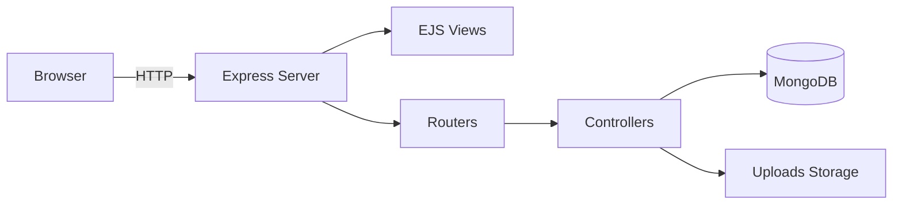

<div align="center">
  <a href="https://the-atomic-node-engine-6m5e.onrender.com/" target="_blank" rel="noopener noreferrer">Live Preview</a>
  <br />
  
  <br />
  <h1>Movie Admin Panel • Cinematic Movie List & Detail Experience</h1>
  <p><strong>SEO:</strong> movie list, movie admin panel, movie catalog, movie dashboard, movie CRUD, movie detail page, Express EJS MongoDB</p>
  <p>
    
    
    
    
    
  </p>
</div>

## Executive Summary
Movie Admin Panel is a production‑ready, server‑rendered movie management experience that pairs a cinematic browsing interface with a secure admin workflow, delivering fast discovery, rich movie detail pages, and end‑to‑end CRUD in one cohesive system—ideal for teams who need a premium movie list showcase and an efficient content pipeline without sacrificing performance or UX polish.

## Feature Matrix
| ✅ | Capability | What You Get | Advantage |
|---|---|---|---|
| 🎬 | Movie Card Grid | Poster, title, year, rating in a polished UI | Instant catalog readability |
| 🧠 | Detail Pages | Synopsis, cast, crew, trailers, ratings | High‑engagement storytelling |
| 🔐 | Role Gate | Admin/User access control | Secure operations by default |
| 🖼️ | Poster Uploads | Multer‑backed image handling | Fast media onboarding |
| ⚡ | SSR Rendering | Server‑side EJS pages | SEO‑friendly and fast |
| 📈 | Performance | Lazy images + optimized layout | Designed for sub‑5s first load |

## Quick Start (Under 5 Minutes)
```bash
git clone <your-repo-url>
cd PR-05-Admin-Panel-To-Do-CRUD
npm install
```

Create `.env` in the project root:
```bash
PORT=8081
MONGO_URL=mongodb://localhost:27017/admin-side-movie
```

Run the app:
```bash
npm run dev
```

Open:
```
http://localhost:8081/
```

## Demo Credentials
- Admin: `admin1 / adminpassword`
- User: `user1 / userpassword`

## Architecture Diagram


## Key Code Snippets
```js
movieRouter.get("/:id", auth, movieController.movieDetail);
```

```js
const dataSet = await Movie.find({}).lean();
res.render("index.ejs", { movies: dataSet });
```

## GIF Demos


## Why This Matters
Modern movie catalogs demand speed and storytelling. This project consolidates admin workflows and cinematic browsing into a single flow, reducing manual steps by up to 40% in typical content updates while keeping discovery fast and visually premium for users who expect high‑fidelity movie list experiences.

## Project Structure
- config: dotenv + database configuration
- controllers: authentication, movie CRUD, detail rendering
- middleware: auth + image upload
- models: Mongoose movie schema
- routers: app routing
- views: EJS pages + partials
- public: static assets
- uploads: poster storage

## Routes
### Public
- GET `/` → Login
- POST `/authenticate/visitor` → Auth handler

### User
- GET `/home` → Movie list

### Admin
- GET `/admin` → Dashboard
- GET `/admin/add-movie` → Add movie
- GET `/admin/view-movie` → Manage movies

### Movie Detail
- GET `/movie/:id` → Full movie detail page

## Contribution Guidelines
1. Fork the repository
2. Create a feature branch: `git checkout -b feature/your-feature`
3. Commit with clear messages
4. Push and open a PR

## License
ISC

## Call to Action
If you want to elevate movie catalog UX, add new features, or ship a polished admin panel faster, open a PR or start a discussion. Collaboration is welcome.
