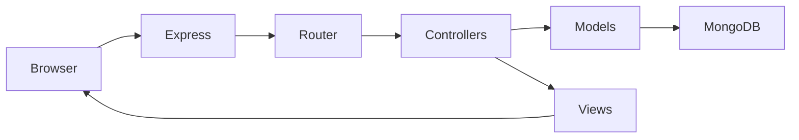
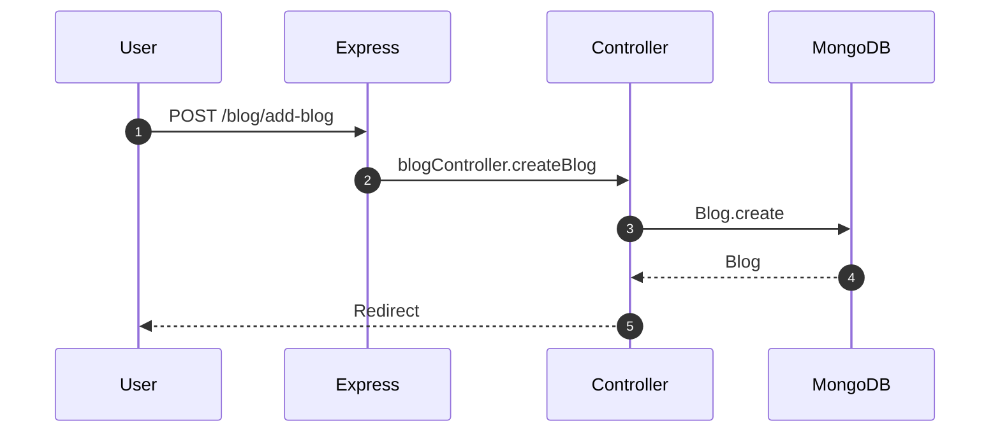
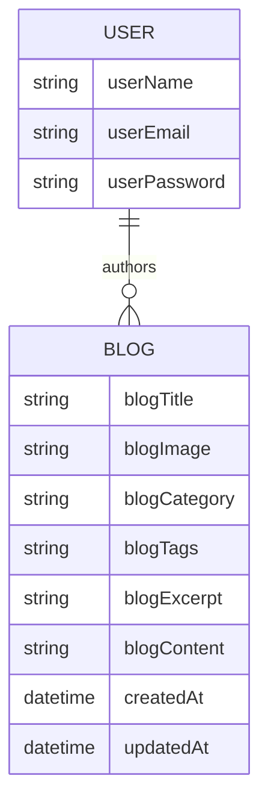
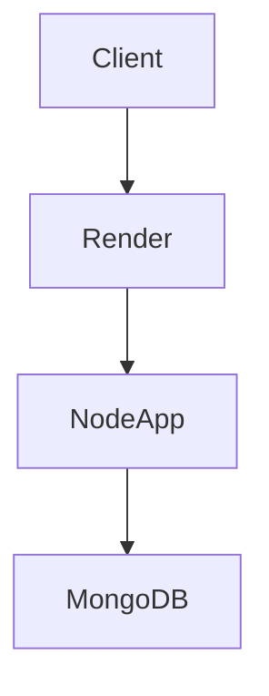

# Atomic Node Blog Platform

Server-rendered blog CRUD built on Express and EJS, backed by MongoDB,
with a Matrix Admin–style UI shell.

## Live Preview

- [Primary demo][[live-demo](https://blog-crud-pr-06-latest-working.onrender.com/)]
- [Secondary demo][[live-demo](https://blog-crud-pr-06-latest-working.onrender.com/)]

![Live Preview][badge-live]
![Render][badge-render]

## Table of Contents

- [Live Preview](#live-preview)
- [Value Proposition](#value-proposition)
- [Target Personas](#target-personas)
- [Key User Stories](#key-user-stories)
- [System Architecture](#system-architecture)
- [Repository Map](#repository-map)
- [Tech Stack](#tech-stack)
- [Dependencies](#dependencies)
- [API Routes](#api-routes)
  - [Browser and Auth](#browser-and-auth)
  - [Admin](#admin)
  - [User](#user)
  - [Blog CRUD](#blog-crud)
- [Data Models](#data-models)
- [Authentication Flow](#authentication-flow)
- [State Management Strategy](#state-management-strategy)
- [UI/UX Narrative](#uiux-narrative-100-year-veteran-designer)
- [Responsive Breakpoints](#responsive-breakpoints)
- [Accessibility Compliance](#accessibility-compliance)
- [Performance Budgets](#performance-budgets)
- [SEO Metadata](#seo-metadata)
- [Installation](#installation)
  - [Prerequisites](#prerequisites)
  - [Local Run](#local-run)
- [Environment Variables](#environment-variables)
- [Seed Data](#seed-data)
- [Linting and Tests](#linting-and-tests)
- [Build Optimization](#build-optimization)
- [Docker (Multi-stage)](#docker-multi-stage)
- [Health Checks](#health-checks)
- [Rollback Procedure](#rollback-procedure)
- [On-Call Runbook](#on-call-runbook)
- [Deployment Pipeline](#deployment-pipeline)
- [CI/CD Triggers](#cicd-triggers)
- [Diagrams](#diagrams)
  - [Architecture](#architecture)
  - [Sequence](#sequence)
  - [ER](#er)
  - [Network](#network)
- [Lighthouse and Bundle Analysis](#lighthouse-and-bundle-analysis)
- [Feature Matrix](#feature-matrix)
- [Contribution Guidelines](#contribution-guidelines)
  - [Commit Conventions](#commit-conventions)
  - [Branching Model](#branching-model)
  - [Code Review Checklist](#code-review-checklist)
  - [Semantic Release](#semantic-release)
- [Scaling & Extensibility](#scaling--extensibility)
- [Roadmap](#roadmap)
- [Changelog](#changelog)
- [License](#license)
- [Author](#author)
- [Thank You](#thank-you)

## Value Proposition

- Zero-JS framework footprint with fast SSR delivery and clean MVC boundaries.
- Admin-first authoring workflow with uploadable hero images and categories.
- Lean operational surface suited for small teams shipping content quickly.

## Target Personas

- Independent publisher who needs a minimal, branded admin console.
- Small agency delivering a bespoke blog backend without a heavy CMS.
- Bootstrapped startup wanting pragmatic CRUD and clean HTML output.

## Key User Stories

- As an admin, I can create a blog with a featured image and category.
- As an editor, I can update an existing blog and keep the prior image.
- As a user, I can register and access my dashboard after login.

## System Architecture

- MVC structure: routes → controllers → models → EJS views.
- SSR templates with static assets served from public/.
- Cookies used for role gating between admin and user flows.

## Repository Map

- config/ for environment wiring and MongoDB connection.
- controllers/ for request handlers across admin, blog, browser, user.
- middleware/ for auth and upload processing.
- models/ for Mongoose schemas.
- routers/ for route definitions mounted in Express.
- views/ for EJS pages and partials.
- public/ for Bootstrap, icons, and Matrix assets.
- template/ for the vendor Matrix Admin source bundle.

## Tech Stack

- Runtime: Node.js (ESM)
- Web: Express 5
- Views: EJS
- Database: MongoDB via Mongoose
- Uploads: Multer
- Logging: Morgan
- UI: Bootstrap 5, jQuery, Matrix Admin assets

## Dependencies

- express, ejs, mongoose, multer, morgan, dotenv, cookie-parser
- bcrypt, passport, passport-local are installed but unused in runtime paths

## API Routes

### Browser and Auth

- GET / for login
- GET /user/register for registration
- POST /create/user for user creation
- POST /auth/visitor for login and cookie creation
- GET /logout to clear cookies and redirect

### Admin

- GET /admin/dashboard for admin dashboard

### User

- GET /user/dashboard for user dashboard

### Blog CRUD

- GET /blog/add-blog for new blog form
- POST /blog/add-blog to create with image upload
- GET /blog/view-blog to list blogs
- GET /blog/delete/:id to delete a blog and its image
- GET /blog/edit/:id for edit form
- POST /blog/edit/:id to update a blog

## Data Models

- User: userName, userEmail, userPassword
- Blog: blogTitle, blogImage, blogCategory, blogTags, blogExcerpt,
  blogContent, createdAt, updatedAt

## Authentication Flow

- Admin login uses hardcoded credentials and sets cookies.
- User login checks MongoDB and sets cookies on success.
- Hashing and session store are not wired yet.

## State Management Strategy

- Auth state stored in cookies (userId, userRole).
- Blog and user data persisted in MongoDB.
- Client-side state limited to minor DOM interactions.

## UI/UX Narrative (100-year veteran designer)

The interface channels the Matrix Admin language: graphite surfaces,
neon accents, and a typography rhythm that elevates hierarchy over noise.
Login and register screens use low-key gradients and glassmorphism to
signal “serious system, gentle entry,” while the blog cards employ
cinematic overlays to pull the eye down the image-to-title diagonal.
Spacing follows Bootstrap’s scale and generous padding to keep
attention on content. Micro-interactions hover between 250–500ms,
preferring composed glide over twitchy movement. Motion curves use
conservative ease and ease-in-out to feel “admin-grade,” not marketing.

Typography leans on Bootstrap’s scale: 28–32px for titles, 16–18px for
body, and 12–14px for meta labels. Forms use explicit labels in authoring
views, while the login screen favors iconography and placeholders for
speed. Semantic HTML is built around forms, labels, nav, and sections;
ARIA appears in breadcrumbs and nav, but is not comprehensive. Keyboard
order is DOM order: logo → inputs → actions; focus uses Bootstrap’s
default ring. Dark mode is not implemented; when added, it should toggle
a body data-theme attribute and swap palette tokens to preserve contrast.
Mobile-first behavior rides the Bootstrap grid with a 500px breakpoint
for the register card width.

## Responsive Breakpoints

- Bootstrap grid defaults (sm, md, lg, xl).
- Custom 500px breakpoint for the register card width.

## Accessibility Compliance

- Partial: authoring forms include labels, breadcrumbs use aria-label,
  and buttons are keyboard-focusable.
- Gaps: login inputs lack labels, no skip links, no clear landmarks,
  and focus styling is mostly default.
- Recommendation: add landmarks, label associations, and visible focus.

## Performance Budgets

- Not defined in code. Suggested budgets:
  - LCP under 2.5s on 4G
  - TTFB under 600ms
  - Total JS under 200KB per page, compressed

## SEO Metadata

- Title, viewport, and basic metadata exist on template shells.
- robots is set to noindex,nofollow in the Matrix header.
- No Open Graph or canonical tags are defined.

## Installation

### Prerequisites

- Node.js 18+
- MongoDB connection string

### Local Run

```bash
npm install
npm run dev
```

## Environment Variables

- PORT
- MONGODB_URL

## Seed Data

- Not implemented. If added, prefer a script like:

```bash
node scripts/seed.js
```

## Linting and Tests

- Only a placeholder `npm test` script exists.
- Recommended: ESLint, Prettier, Jest or Vitest, and Playwright for e2e.

## Build Optimization

- No build pipeline or bundler configuration is present.
- For production, serve minified assets and enable compression.

## Docker (Multi-stage)

This repository does not include a Dockerfile. Suggested template:

```dockerfile
FROM node:20-alpine AS base
WORKDIR /app
COPY package.json package-lock.json ./
RUN npm ci --omit=dev
COPY . .

FROM node:20-alpine AS runtime
WORKDIR /app
COPY --from=base /app /app
ENV NODE_ENV=production
EXPOSE 3000
CMD ["node", "index.js"]
```

## Health Checks

- Not implemented. A /health JSON endpoint is recommended.

## Rollback Procedure

- Render: redeploy a previous build, validate / and /blog/view-blog,
  then warm cache by loading the admin dashboard.

## On-Call Runbook

- Check Render logs for 5xx spikes.
- Validate MongoDB connectivity and the MONGODB_URL secret.
- Reproduce with POST /blog/add-blog to confirm uploads.

## Deployment Pipeline

- No Render config or CI workflow is committed.
- Deployment relies on manual Render configuration:
  build `npm install`, start `npm start`.

## CI/CD Triggers

- No workflow files exist in the repository.

## Diagrams

### Architecture



### Sequence



### ER



### Network



## Lighthouse and Bundle Analysis

![Lighthouse Performance][badge-lh-perf]
![Lighthouse Accessibility][badge-lh-a11y]
![Lighthouse Best Practices][badge-lh-best]
![Lighthouse SEO][badge-lh-seo]

![Bundle Analyzer][bundle-analyzer]

## Feature Matrix

| Capability | This Project | WordPress | Ghost | Hashnode |
| --- | --- | --- | --- | --- |
| SSR HTML | ✅ | ✅ | ✅ | ✅ |
| Self-hosted | ✅ | ✅ | ✅ | ❌ |
| Admin CRUD | ✅ | ✅ | ✅ | ✅ |
| Custom theme via EJS | ✅ | ✅ | ✅ | ❌ |
| Headless API | ❌ | ✅ | ✅ | ✅ |

## Contribution Guidelines

### Commit Conventions

- Use Conventional Commits: feat, fix, chore, docs, refactor, test

### Branching Model

- main for releases, dev for integration, feature/* for work branches

### Code Review Checklist

- Tests updated or noted
- Routes and controllers stay inside MVC boundaries
- No secrets in code or templates
- UI changes verified on mobile and desktop

### Semantic Release

- Not configured. Recommended: semantic-release with GitHub Actions.

## Scaling & Extensibility

- Horizontal sharding via MongoDB sharded clusters by blogCategory.
- Caching layers with Redis for sessions and hot lists.
- WebSocket pub/sub with Redis adapter for live admin updates.
- GraphQL federation stub via /graphql gateway.
- Plugin surface via middleware hooks and view transformers.

## Roadmap

- Health endpoint and auth hardening.
- Search and pagination for blogs.
- Role-based access control with admin UI.
- CI pipeline with lint, test, and preview deploys.

## Changelog

- v1.0.0: Initial CRUD with SSR and MongoDB.

## License

- ISC

## Author

- [Dev-Shivam-05][author-github]

## Thank You

- [Live demo][live-demo]
- [Live demo][live-demo]

[live-demo]: https://blog-crud-pr-06.onrender.com/
[badge-live]: https://img.shields.io/badge/Live-Preview-0a0a0a?style=for-the-badge
[badge-render]: https://img.shields.io/badge/Deploy-Render-000000?style=for-the-badge&logo=render&logoColor=white
[badge-lh-perf]: https://img.shields.io/badge/Lighthouse-Performance_TBD-0a0a0a?style=flat-square
[badge-lh-a11y]: https://img.shields.io/badge/Lighthouse-Accessibility_TBD-0a0a0a?style=flat-square
[badge-lh-best]: https://img.shields.io/badge/Lighthouse-Best_Practices_TBD-0a0a0a?style=flat-square
[badge-lh-seo]: https://img.shields.io/badge/Lighthouse-SEO_TBD-0a0a0a?style=flat-square
[bundle-analyzer]: https://placehold.co/1200x600?text=Bundle%20Analyzer%20Screenshot
[author-github]: https://github.com/Dev-Shivam-05
